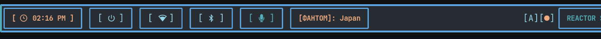
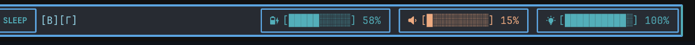
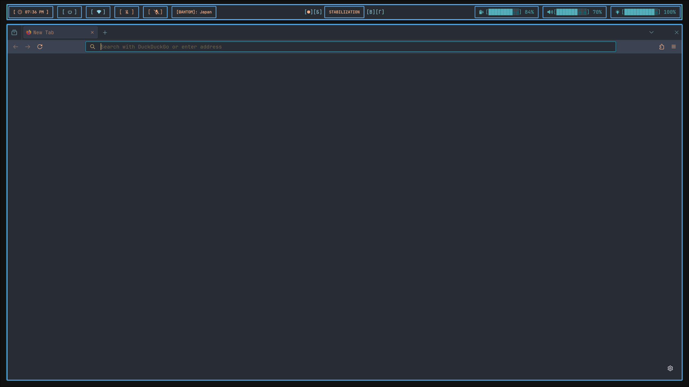

# Waybar Config

───────────────────────────────────────────────  
 °˖* ૮( • ᴗ ｡)っ🍸 shheersh - Dionysus vers. 1.0   
 ───────────────────────────────────────────────  
 
## Custom **Waybar** config.
  
---

##  Features
- **Custom workspace** clickable modules (`workspace-1.sh` … `workspace-4.sh`)
- **Battery status** with JSON script + native fallback, dynamic icons, warnings
- **Volume control** via PipeWire (`wpctl`) with mute, scroll-to-change volume, and right-click sound settings.
- **Microphone toggle** with instant mute/unmute
- **Brightness control** with slider, scroll actions, and toggle.
- **VPN integration** with NordVPN status.
- **Bluetooth module** with custom toggle script and tooltips
- **Network widget** with icons, bandwidth stats, and `nm-connection-editor` launcher
- **ASUS laptop profile** module, showing/toggling performance modes
- **Power menu** integration via Rofi  

  

```
├── README.md
├── config
├── demo.png
├── scripts
│   ├── asus-profile.sh
│   ├── battery.sh
│   ├── bluetooth-toggle.sh
│   ├── brightness-toggle.sh
│   ├── brightness.sh
│   ├── mic.sh
│   ├── nordvpn-status.sh
│   ├── nordvpn-toggle.sh
│   ├── powermenu.sh
│   ├── volume.sh
│   └── workspaces
│       ├── workspace-1.sh
│       ├── workspace-2.sh
│       ├── workspace-3.sh
│       └── workspace-4.sh
└── style.css
```


## Requirements
- `hyprland` (hyprctl for workspaces)
- `rofi` (for power menu)
- `wpctl` (PipeWire volume control)
- `pavucontrol` or `pwvucontrol` (optional sound settings UI)
- `playerctl`
- `brightnessctl`
- `nm-connection-editor`
- `nordvpn` (CLI client)
- `pactl` (PulseAudio/PipeWire control)
- `Nerd Font` for icons

## Usage
Requires a Nerd Font (for icons such as 󰤆, 󰖪, etc.)
Make sure scripts are executable:  
```chmod +x ~/.config/waybar/scripts/*.sh```  
```chmod +x ~/.config/waybar/scripts/workspaces/*.sh```
- `config` → main Waybar configuration
- `style.css` → custom styling
- `scripts/` → helper scripts for modules

